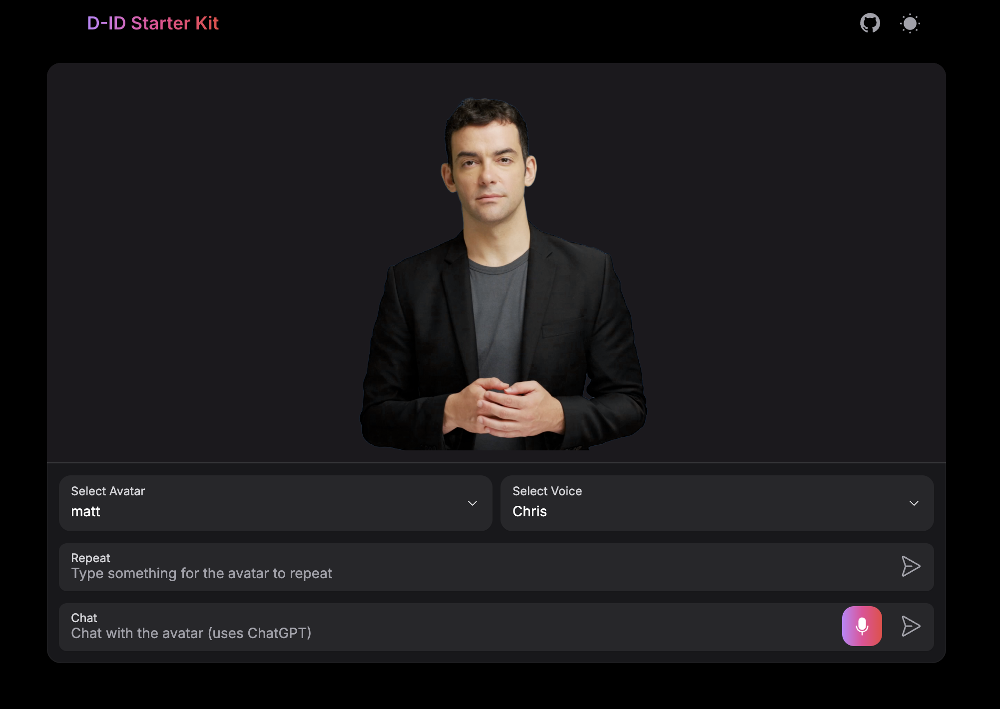

# NextJS D-ID Starter Kit



This project demonstrates the integration of D-ID's and OpenAI's Whisper within a NextJS application. It allows users to interact with AI-powered avatars using text input or voice commands, showcasing the potential of conversational AI interfaces.

## Features

- Interactive avatar selection
- Text-to-speech functionality
- Voice input using OpenAI's Whisper for transcription
- Integration with OpenAI's GPT model for conversational responses

## Getting Started

### Prerequisites

- Node.js (v14 or later)
- npm (v6 or later)
- A D-ID API key
- An OpenAI API key

### Setting up the project

1. Clone this repository:

   ```
   git clone https://github.com/WillKre/nextjs-whisper-d-id.git
   cd nextjs-whisper-d-id
   ```

2. Install dependencies:

   ```
   npm install
   ```

3. Set up environment variables:
   Run `npm run setup-env` or create a `.env` file in the root directory and add the following:

   ```
   D_ID_API_KEY=your_d_id_api_key
   OPENAI_API_KEY=your_openai_api_key
   NEXT_PUBLIC_OPENAI_API_KEY=your_openai_api_key
   ```

   Then populate the values:

   - To obtain a D-ID API key, sign up at [D-ID's website](https://www.d-id.com/) and navigate to the API section in your account settings.
   - For an OpenAI API key, create an account at [OpenAI's website](https://openai.com/) and generate an API key in your account dashboard.

4. Start the development server:

   ```
   npm run dev
   ```

5. Open [http://localhost:3000](http://localhost:3000) in your browser to see the application.

## Usage

1. Select an avatar from the dropdown menu.
2. Choose a voice for the avatar.
3. Type text in the "Repeat" input to make the avatar speak that text.
4. Use the "Chat" input to have a conversation with the AI-powered avatar:
   - Type your message and press enter, or
   - Click the microphone icon to use voice input (requires browser permission).

### Voice Selection

The project is set up to use [ElevenLabs](https://elevenlabs.io/), a leading voice service, for generating realistic voices. The available voices are fetched dynamically from the ElevenLabs API.

If you want to use voices from other providers or add more options:

1. Update the API endpoint in `app/api/voices/route.ts`:

   ```typescript
   const response = await fetch("https://api.elevenlabs.io/v1/voices", {
     // ... existing headers ...
   });
   ```

   Replace the URL with the endpoint of your chosen voice provider.

2. Ensure that the response is mapped to match the expected format:

   ```typescript
   const transformedVoices = data.voices.map((voice) => ({
     voice_id: voice.voice_id,
     name: voice.name,
   }));
   ```

## Project Structure

- `app/`: Contains the main application code and API routes.
- `components/`: React components used throughout the application.
- `utils/`: Utility functions and helper modules.
- `types/`: Common TypeScript types which are used across the project.
- `styles/`: Global styles and Tailwind CSS configuration.

## Technology Stack

- [Next.js](https://nextjs.org/): React framework for building the application
- [D-ID API](https://www.d-id.com/): For generating interactive avatars
- [OpenAI API](https://openai.com/): For GPT-based conversation and Whisper transcription
- [NextUI](https://nextui.org/): UI component library
- [Tailwind CSS](https://tailwindcss.com/): For styling

## Contributing

Contributions are welcome! Please feel free to submit a Pull Request.
